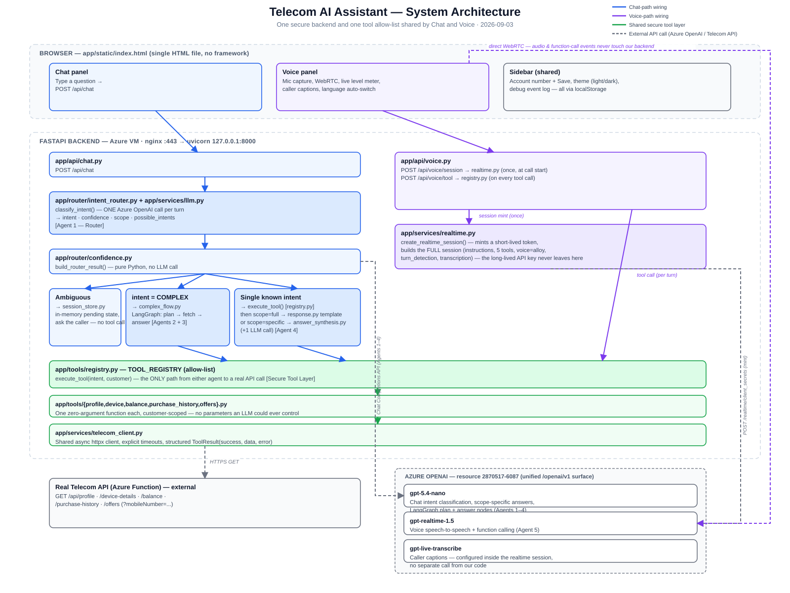

# Architecture

Detailed, file-by-file explanation of how the Telecom AI Assistant works — how many LLM-backed
"agents" exist, what each one's job is, which Python module owns each piece of the chat and voice
paths, and how everything is wired together. `PROGRESS.md` is the running log of *how* this was
built and what broke along the way; this document is the *current state*, organized by system, not
by history.



*(If the image doesn't render inline, open [`architecture-diagram.svg`](architecture-diagram.svg)
directly — it's a plain SVG, viewable in any browser.)*

---

## The short version

One FastAPI backend serves two front ends — a **chat** endpoint and a **voice** (WebRTC) session —
and both funnel every real account lookup through the *same* secure, allow-listed tool layer. No
LLM, in either path, can ever call an arbitrary URL, function, or supply its own value for the
customer's phone number. Five distinct LLM calls exist in the system ("agents" below); everything
else — routing decisions, the tool allow-list, response templates — is deterministic Python with no
model involved.

---

## How many agents, and what each one does

"Agent" here means *a point where an LLM is given a prompt and asked to decide or generate
something* — as opposed to plain Python logic. There are **5**, all on Azure OpenAI, plus one
auxiliary model that never makes a decision (transcription):

| # | Agent | Model | File | Fires when | What it decides/produces |
|---|-------|-------|------|-------------|---------------------------|
| 1 | **Router** | `gpt-5.4-nano` | `app/services/llm.py` (`classify_intent`) | Every chat turn | `intent` (one of 5 + COMPLEX + UNKNOWN), `confidence`, `scope` (full/specific), `possible_intents`, a clarification question if uncertain — **all in one call** |
| 2 | **LangGraph plan node** | `gpt-5.4-nano` | `app/services/complex_flow.py` (`_plan_node`) | Only when Router says `COMPLEX` | Which of the 5 tools (0–5) are relevant to answer a multi-domain or advisory question |
| 3 | **LangGraph answer node** | `gpt-5.4-nano` | `app/services/complex_flow.py` (`_answer_node`) | Only when Router says `COMPLEX`, after the plan node's tools have been fetched | The final answer, grounded in the real fetched data from however many tools node 2 picked |
| 4 | **Scope-specific synthesizer** | `gpt-5.4-nano` | `app/services/answer_synthesis.py` (`synthesize_specific_answer`) | Only when Router says `scope=specific` (a narrow question like "sms" or "is my phone 5g") | A short answer extracting just the one fact asked about, from the single tool's already-fetched data |
| 5 | **Realtime voice model** | `gpt-realtime-1.5` | `app/services/realtime.py` (session config only — the model itself runs on Azure, not in our code) | The entire duration of a voice call | The full spoken conversation: understanding audio, deciding when to call a tool, speaking the answer, matching the caller's language |
| — | *Caller transcription (not a decision-maker)* | `gpt-live-transcribe` | configured inside the same voice session, `app/services/realtime.py` | Every voice utterance, when transcription is configured | Text captions of what the caller said — pure transcription, no reasoning, used only for display and for the client-side language-switch logic |

**Cost/latency shape this creates:**
- A **broad** chat question ("what's my balance") touches only Agent 1, then a deterministic
  template — one LLM call, ~2.9s typical.
- A **narrow** chat question ("sms") touches Agent 1 + Agent 4 — two LLM calls, ~5–8s.
- A **COMPLEX** chat question ("am I eligible for 5G", "should I get roaming") touches Agent 1 +
  Agent 2 + Agent 3, with N concurrent tool fetches in between — two LLM calls + fetch latency,
  ~8–9.5s.
- **Voice** is a standing session: Agent 5 runs continuously; individual tool calls inside it are
  plain Python (no extra LLM call), but each voice turn now also waits ~1s for the caller's
  transcript before the client tells Agent 5 which language to answer in (see
  [Language switching](#language-switching-why-its-client-driven) below) — that wait is deliberate,
  not incidental.

---

## Chat request lifecycle

```
Browser                    FastAPI                          Azure OpenAI              Telecom API
  │  POST /api/chat           │                                    │                      │
  ├──────────────────────────>│ app/api/chat.py                    │                      │
  │                           │                                    │                      │
  │                           │ session_store.get_pending()         │                      │
  │                           │ (in-memory dict; a prior clarifying  │                      │
  │                           │  question narrows the candidates)    │                      │
  │                           │                                    │                      │
  │                           │ route_intent() ─────────────────────>│  [Agent 1: Router]   │
  │                           │<─────────────────────────────────────┤                      │
  │                           │ {intent, confidence, scope, ...}     │                      │
  │                           │                                    │                      │
  │                    needs_clarification?  ──yes──> return type="clarification"          │
  │                           │        (no tool call — nothing is guessed)                  │
  │                           │no                                   │                      │
  │                    intent == COMPLEX? ──yes──> complex_flow.run_complex_flow()          │
  │                           │        (see LangGraph sub-flow below)                        │
  │                           │no                                   │                      │
  │                           │ execute_tool(intent, customer) ─────────────────────────────>│
  │                           │<─────────────────────────────────────────────────────────────┤
  │                           │ scope == "specific"?                │                      │
  │                           │  yes → answer_synthesis.py ─────────>│  [Agent 4]           │
  │                           │  no  → response.py (template, no LLM)│                      │
  │<──────────────────────────┤                                    │                      │
  │  {type, intent, message,  │                                    │                      │
  │   data, session_id}       │                                    │                      │
```

**LangGraph sub-flow** (only for `intent == COMPLEX`, `app/services/complex_flow.py`):

```
START ──> plan ──> fetch ──> answer ──> END
          │         │          │
     [Agent 2]  plain Python  [Agent 3]
     picks 0–5   asyncio.gather()  writes the final
     tool names  over the picked   answer, grounded
     (JSON)      tools, via the    in the JSON from
                 SAME registry.py  every tool that
                 chat/voice use    succeeded
```

The `fetch` node is not an agent — it is deterministic Python that calls
`app/tools/registry.execute_tool()` concurrently for whatever the plan node picked, exactly the same
function chat's single-intent path and voice's tool calls use. If the plan node's JSON names
something outside the 5 real intents, it's filtered out before ever reaching `execute_tool` — the
same allow-list discipline as everywhere else in the system.

---

## Voice call lifecycle

Voice is architecturally different from chat in one important way: **audio never touches our
backend.** The browser talks to Azure's Realtime API directly over WebRTC; our FastAPI backend's
only jobs are (1) minting a short-lived credential so the browser never sees the real API key, and
(2) being the trusted gateway the browser calls through whenever the realtime model wants real
account data.

```
Browser                         FastAPI                    Azure Realtime API (Agent 5)
  │  POST /api/voice/session       │                              │
  ├────────────────────────────────>│ app/api/voice.py             │
  │                                 │ realtime.create_realtime_session()
  │                                 ├──────────────────────────────>│  POST /realtime/client_secrets
  │                                 │  (api-key: the real secret)   │  session: model, instructions,
  │                                 │<──────────────────────────────┤  5 tool defs, voice=alloy —
  │                                 │  {value: "ek_..."} ephemeral  │  but NOT transcription (see below)
  │<────────────────────────────────┤                              │
  │  {client_secret, realtime_url,  │  (real API key stays          │
  │   post_connect_update}          │   server-side; only the       │
  │                                 │   short-lived token leaves)   │
  │                                                                │
  │  ── from here, browser talks DIRECTLY to Azure ──              │
  │  RTCPeerConnection + mic track + data channel                  │
  │  POST offer.sdp, Authorization: Bearer ek_...  ───────────────>│
  │<─────────────────────────────────────────────── SDP answer ────┤
  │  WebRTC connected (audio media + data channel)                 │
  │                                                                │
  │  data channel: session.update (post_connect_update) ──────────>│  enables transcription
  │                                                                │  (see below for why this
  │                                                                │   is a SEPARATE step)
  │                                                                │
  │  🎤 caller speaks ───────────────── raw audio (WebRTC media) ─>│
  │  event: input_audio_buffer.committed                          │
  │  event: conversation.item.input_audio_transcription.completed │
  │  browser detects language from the transcript's script,       │
  │  sends session.update (CURRENT CALLER LANGUAGE: ...) THEN      │
  │  sends response.create ────────────────────────────────────────>│  (see Language switching)
  │                                                                │
  │  event: response.function_call_arguments.done                │
  │  {name: "get_balance", call_id, arguments: "{}"} ──────────────┤
  │                                                                │
  │  POST /api/voice/tool {function_name, mobile_number}          │
  ├────────>│ app/api/voice.py                                    │
  │         │ FUNCTION_NAME_TO_INTENT["get_balance"] = "BALANCE"   │
  │         │ execute_tool("BALANCE", customer) — SAME registry.py │
  │<────────┤ as chat, same telecom API                            │
  │  raw data (not a template — the realtime model phrases it)     │
  │                                                                │
  │  data channel: conversation.item.create (function_call_output) │
  │  then: response.create ─────────────────────────────────────────>│
  │<────────────────────────────────────── spoken reply, audio ────┤
```

### Why transcription is configured *after* connecting, not at session creation

Azure's `client_secrets` endpoint (the mint-time REST call) returns a `DeploymentNotFound` error if
`audio.input.transcription` is included in that payload — confirmed live, a known Azure issue, not a
configuration mistake on our side. The fix: mint the session *without* transcription, then send a
`session.update` event over the already-open data channel. `create_realtime_session()` builds that
update as `post_connect_update`, using the exact same `_session_config()` function as the mint
payload — one source of truth, so nothing (voice, instructions, tools) can silently differ between
the two. This mattered in practice: an earlier version sent only the transcription field in that
update, and Azure's `session.update` turned out to **replace nested objects wholesale rather than
merge them** — so the voice silently reset to something other than `alloy` every time transcription
was enabled, until the update started re-stating the *entire* session.

### Language switching: why it's client-driven

Left to its own judgment, the realtime model kept whatever language the *previous* turn was in, even
when the caller clearly switched (spoke Hindi, then asked a question in Telugu, and got a Hindi
answer back — once even explaining "your first question was in Hindi, so I'll stay in Hindi"). A
naive fix — telling it the detected language after the fact — made things worse, because the
caller's transcript arrives *after* the model has often already started answering.

The real fix changes who's in control of turn-taking. When transcription is configured, the
post-connect session sets `turn_detection.create_response = false`: Azure's server VAD still detects
when the caller stops talking and commits the utterance, but it does **not** automatically generate
a reply. The browser (`app/static/index.html`) then:

1. Waits for the caller's transcript (with a 2.5s fallback timer so a missing transcript never
   leaves the caller in silence).
2. Detects its script by Unicode block (Telugu, Tamil, Devanagari, Arabic-script renderings of
   spoken Hindi, Latin, …) — filler utterances ("Yeah.", "ok", "हाँ") are deliberately below the
   detection threshold so they can't flip the session's language.
3. Sends `session.update` with an explicit `CURRENT CALLER LANGUAGE: <lang>` line appended to the
   instructions — a stated fact for the model to follow, not something to infer — and, on an actual
   switch, an instruction to answer in the new language *and* ask whether to continue in it.
4. Only then sends `response.create`.

This costs about one extra second per voice turn. It's the price of the language being
deterministic instead of a guess. Without a transcription model configured, none of this engages —
`create_response` stays `true` and Azure auto-responds as before.

---

## Security model

The same three rules hold in both chat and voice:

1. **The customer's phone number never comes from an LLM.** It's a field the browser sends directly
   on every request (`mobile_number` in chat, tied to the account-number field in the sidebar) —
   neither the router nor the realtime model can supply or override it. (`app/services/customer_context.py`
   documents this as the seam a future real-auth phase will replace.)
2. **Neither LLM can call anything but a name on a fixed allow-list.** The router produces an intent
   *string* (`"BALANCE"`), never a URL or function reference; the realtime model can request one of
   exactly 5 zero-argument function names. Both paths converge on
   `app/tools/registry.py`'s `TOOL_REGISTRY` — `execute_tool()` raises `UnknownIntentError` for
   anything not in it, including a hallucinated or LangGraph-planned tool name that doesn't exist.
3. **The 5 real API calls are the only way out to the telecom backend.** `app/tools/{profile,device,
   balance,purchase_history,offers}.py` each wrap one endpoint via the shared
   `app/services/telecom_client.py` (explicit timeouts, structured `ToolResult`, credentials never
   logged). No other outbound call to the telecom API exists anywhere in the codebase.

An LLM failure (timeout, malformed JSON, API error) always degrades to a safe fallback — low
confidence, an empty plan, a polite "couldn't fetch that" — never a guess and never a crash.

---

## Frontend

`app/static/index.html` — a single dependency-free HTML file (no framework, no build step, no web
fonts, inline SVG icons). Chat and voice render into the same conversation thread; a composer bar
switches between a text input and a live mic-level meter. Light/dark theme is token-based (light is
the base palette, dark is a `:root[data-theme="dark"]` override), defaults to the OS preference, and
is togglable/persisted per browser. A collapsible debug drawer logs every raw realtime event, which
is what made diagnosing the Azure-specific issues above possible without a browser debugger.

---

## Deployment

`deploy/` holds the versioned deployment: `telecom-assistant.service` (systemd, runs uvicorn on
`127.0.0.1:8000`, `Restart=always`, capped at 400 MB), `nginx.conf` (HTTPS on 443 with a self-signed
cert, HTTP redirects to it — required, not cosmetic, since browsers only grant microphone access on
a secure origin), and `setup_vm.sh` (idempotent: packages, venv, the cert, the nginx site, the
systemd unit — safe to re-run). Redeploying is two lines on the VM:
`git pull && sudo ./deploy/setup_vm.sh`. Full details, including what was learned getting this
working the first time, are in `PROGRESS.md`'s Phase 10 entry.

---

## File reference

| Path | Responsibility |
|---|---|
| `app/main.py` | FastAPI app, CORS, request-ID logging middleware, global exception handler, serves `app/static/index.html` at `/` |
| `app/config.py` | `Settings` (pydantic-settings, reads `.env`) |
| `app/api/health.py` | `GET /health` |
| `app/api/chat.py` | `POST /api/chat` — the chat lifecycle above |
| `app/api/voice.py` | `POST /api/voice/session`, `POST /api/voice/tool` |
| `app/router/schemas.py` | `RouterResult` (intent, confidence, scope, possible_intents, clarification_message) |
| `app/router/intent_router.py` | `route_intent()` — calls Agent 1, applies the confidence threshold |
| `app/router/confidence.py` | `build_router_result()` — pure Python: threshold, allow-list, COMPLEX bypass, scope validation |
| `app/services/llm.py` | Agent 1 (`classify_intent`) — the router's system prompt and Azure OpenAI call |
| `app/services/complex_flow.py` | Agents 2 & 3 — the LangGraph `plan → fetch → answer` graph |
| `app/services/answer_synthesis.py` | Agent 4 — narrow-question answers grounded in one tool's data |
| `app/services/response.py` | Deterministic per-intent answer templates (no LLM) |
| `app/services/session_store.py` | In-memory `PendingClarification` per `session_id` |
| `app/services/customer_context.py` | `CustomerContext` — the seam real auth will replace |
| `app/services/realtime.py` | Mints the voice session, builds the shared session config (Agent 5's setup) |
| `app/services/telecom_client.py` | Shared async HTTP client to the real telecom API |
| `app/tools/registry.py` | `TOOL_REGISTRY` — the allow-list; `execute_tool()` |
| `app/tools/{profile,device,balance,purchase_history,offers}.py` | One function each, wrapping one real endpoint |
| `app/static/index.html` | The entire frontend |
| `scripts/live_smoke.py` | 47-check live regression matrix against a running server (local or, via `SMOKE_BASE`, the VM) |
| `deploy/` | systemd unit, nginx site, idempotent setup script |
| `docs/telecom_ai_assistant_implementation_plan.md` | The original plan this was built against |
| `docs/architecture-diagram.svg` | The diagram at the top of this document |
| `PROGRESS.md` | Phase-by-phase build log — read its "Where things stand" section for a fast pickup |

---

## Known limitations

- gpt-5-series models run at temperature 1 with no override, so a handful of borderline chat
  phrasings occasionally wobble between runs even after prompt anchoring — real, low-frequency,
  inherent model variance rather than a bug to keep chasing.
- Azure's Realtime API does not stream transcription deltas (Microsoft-confirmed) — captions land
  after each utterance, not word-by-word. True live captions would need Azure AI Speech running in
  parallel; deliberately not started.
- `gpt-live-transcribe`'s default quota is 10 requests/minute; very rapid back-to-back voice turns
  could hit it.
