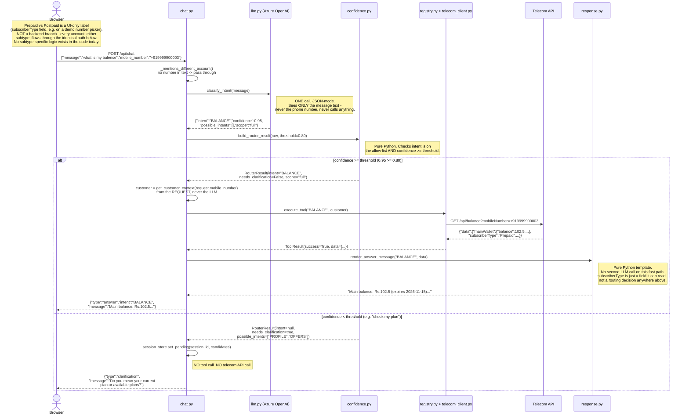

# Chat flow — user input → LLM → Python → answer

Traces `POST /api/chat` through the real code paths for a high-confidence answer and a
low-confidence clarification (the two possible outcomes for a single-lookup intent). See
[ARCHITECTURE.md](ARCHITECTURE.md) for the full system and [chat.py](../app/api/chat.py) /
[llm.py](../app/services/llm.py) / [confidence.py](../app/router/confidence.py) for the actual
code. Voice isn't shown here — it's a live bidirectional session, not a single request/response,
so it doesn't fit this diagram shape (see ARCHITECTURE.md's voice section instead).

